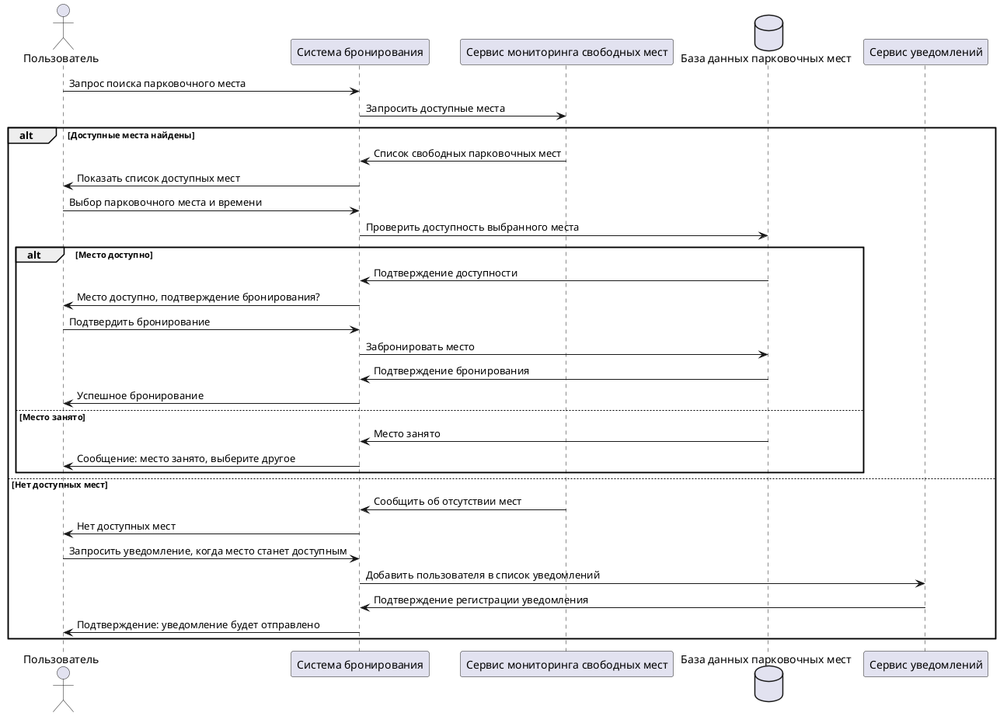

# Сценарий Sequence диаграммы бронирования парковочного места

---

1. Пользователь отправляет запрос на поиск свободных парковочных мест.
2. Система бронирования взаимодействует с сервисом мониторинга для получения списка доступных мест.
3. Возможные сценарии:
   - Если доступны свободные места:
     1. Список мест передается пользователю.
     2. Пользователь выбирает место и время.
     3. Система проверяет доступность выбранного места:
        - Если место доступно:
          - Система бронирует место.
          - Пользователь получает подтверждение.
        - Если место занято:
          - Система уведомляет пользователя о занятости.
   - Если свободных мест нет:
     1. Система уведомляет пользователя об отсутствии мест.
     2. Пользователь может запросить уведомление, когда место станет доступным.
4. Если уведомление запрошено:
   - Пользователь добавляется в список уведомлений через сервис уведомлений.
   - Система подтверждает регистрацию уведомления.
