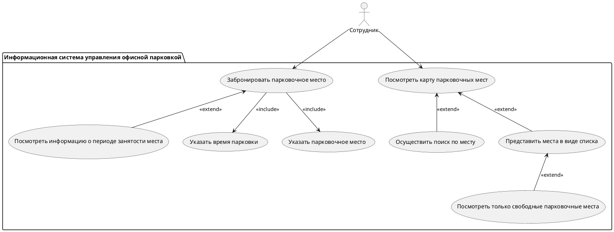

# Сценарий бронирования парковочного места

---

1. Сотрудник начинает процесс бронирования через интерфейс системы.
2. Система предоставляет доступ к следующим функциям:
   - Просмотр карты парковочных мест.
   - Фильтрация мест (свободные, занятые).
   - Указание временных интервалов.
3. Система проверяет доступность выбранного места.
4. Если место доступно:
   - Система подтверждает бронирование.
   - Сотруднику отправляется подтверждение.
5. Если место недоступно:
   - Система сообщает об отсутствии доступного места.
